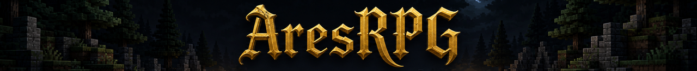

  

  
  

<h3 align=center>A source-available web MMORPG built on Sui and Three.js — developed in the open</h3>
 

# The experience

Create your character and step into the lands of Ares — a voxel world rendered in your
browser, where the blockchain itself is the game server. Hunt creatures in turn-based
tactical combat, level up, gather resources, delve dungeons, and own everything you earn:
your character and every piece of gear — each minted with its own rolled stats — live
on-chain, yours.

# Try the game

The testnet is live: **https://testnet.aresrpg.world** — a Google account is all you need
(zkLogin creates your wallet; gameplay is sponsored, no coins required to play).

# Contribute

The whole game is developed in one source-available repository — client, voxel engine,
combat sim, Sui Move modules, SDK, and read layer:

- **[aresrpg/aresrpg](https://github.com/aresrpg/aresrpg)** — read it, build it, run it
  locally, and contribute improvements back. Issues are the front door for bugs, ideas,
  and questions; `good-first-issue` marks self-contained starters.

# Contact

Questions, feedback, or just want to talk to the team? Join our
[discord](https://discord.gg/aresrpg).
